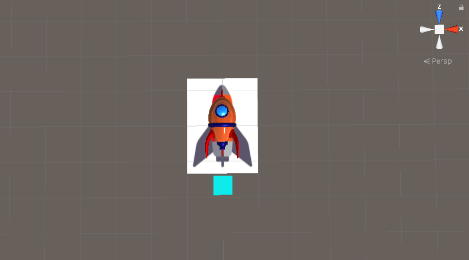
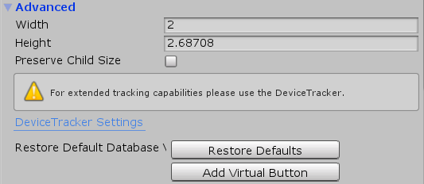

# 3D Programming & Design

- Date: 2019/12/18

- [实现效果](#run)
- [实现过程](#produre)
    - [Vuforia使用](#use)
    - [虚拟按键小游戏](#game)

<h2 id="run">实现效果</h2>

[演示视频](演示视频.mp4)  
  
  

<h2 id="produre">实现过程</h2>

<h3 id="use">Vuforia使用</h3>

1. 进入官网[https://developer.vuforia.com](https://developer.vuforia.com)注册登录账号  
  

2. 点击Develop, 进行License Key的获取  
  
  

3. 点击Target Manager, 添加数据库  
  

4. 点击Add Target, 我们使用Single Image来进行AR识别  
  
  

5. 将数据库中的特定文件下载下来  
  
  

6. 将unitypackage导入unity中  
  

7. 确保unity中有vuforia SDK, 没有的话可以在Unity Hub beta中进行添加  
  

8. 添加AR相机  
  

9. 在VuforiaConfiguration中添加License Key
  

10. 添加ImageTarget, 并将AssetStore中下载的模型挂载到ImageTarget下, 作为子物体  
  

11. 在ImageTarget的Inspector面板中调整模型与Image的尺寸, 以方便显示.  
  

12. 运行项目, 将数据库中的图片放置到摄像头下, 得到AR效果  
  

<h3 id="game">虚拟按键小游戏</h3>

我们在上面的基础上增加一个Launch虚拟按钮, 触碰虚拟按钮后让Rocket升空.  
右键点击ImageTarget, 在Inspector中选择Add VirtualButton  
  
在Virtual中挂载子物体Plane  
  
编写代码控制相应的动画  
  
```c#
using System.Collections;
using System.Collections.Generic;
using UnityEngine;
using Vuforia;

public class VirtualButton : MonoBehaviour, IVirtualButtonEventHandler {
    public VirtualButtonBehaviour[] actions;
    public Animator animator;

    void Start() {
        actions = GetComponentsInChildren<VirtualButtonBehaviour>();
        for (int i = 0; i < actions.Length; i++) {
            actions[i].RegisterEventHandler(this);
        }
    }

    public void OnButtonPressed(VirtualButtonBehaviour vb) {
        animator.SetTrigger("Launch");
        animator.ResetTrigger("Idle");
    }

    public void OnButtonReleased(VirtualButtonBehaviour vb) {
        animator.SetTrigger("Idle");
        animator.ResetTrigger("Launch");
    }
}
```
[实现效果](#run)  
github地址: [https://github.com/boluoDhai/3D_HW11](https://github.com/boluoDhai/3D_HW11)  


